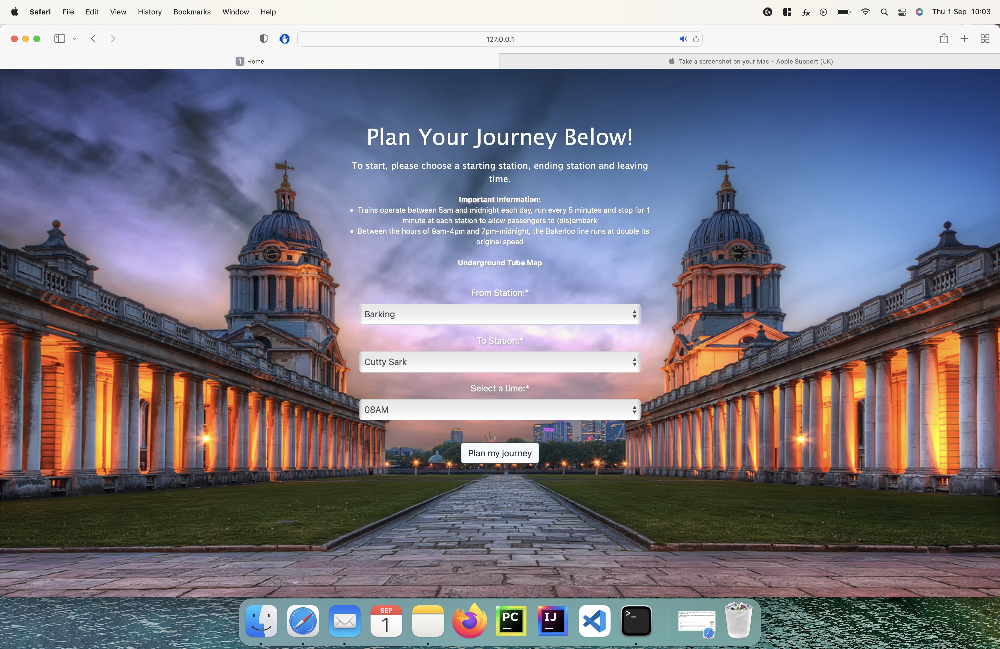
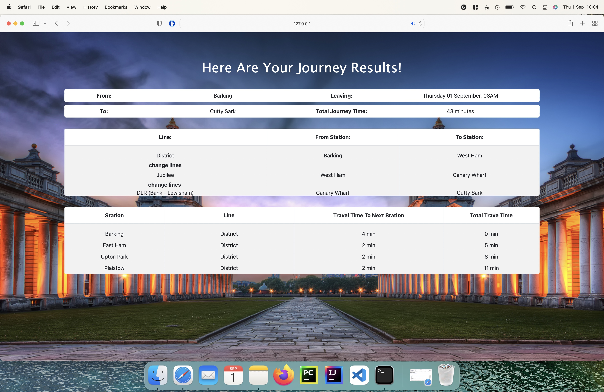
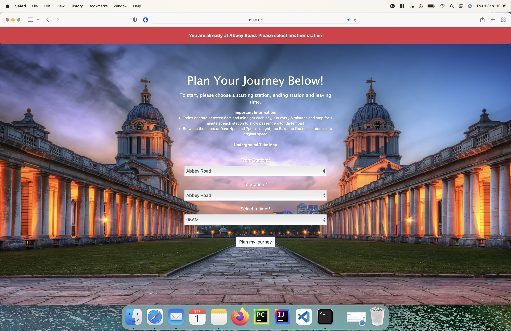

# Django London Underground Journey Planner

This project was completed in 2020 with the aim of the calculating the shortest route between two London underground stations, using Dijkstra's algorithm and linked lists in python. The django web-framework was used to output the route results via the web.

## Table of Contents

* [Installation](#installation)
    * [Dependencies](#dependencies)
* [Getting started](#getting-started)
* [Example Screenshots](#example-screenshots)

## Installation

create a new directory, move to it and clone this repository:

```
$ git clone https://github.com/yrider/Django_London_Underground_Journey_Planner.git
```

Create a virtual environment and activate it:

```
$ python -m venv venv
$ source venv/bin/activate
```

Run the requirements.txt file:

```
$ pip install -r requirements.txt
```

You should now be able to run the django project, click [here](#getting-started) for support.

### Dependencies

This project requires:

* python >= 3.8
* Django == 3.1.3
* django-crispy-forms == 1.9.2
* openpyxl == 3.0.5
* pandas == 1.1.4
* xlrd == 1.2.0

### Getting Started

Before running the program, please ensure:

1) Your virtual environment is active.
2) You are in the root directory where the *manage.py* file is located.

Run the program via django:

```
$ python manage.py runserver
```

Within a minute the following should appear:

```
Django version 3.1.3, using settings 'LondonUndergroundPlanner.settings'
Starting development server at http://127.0.0.1:8000/
Quit the server with CONTROL-C.
```

Copy and paste ```http://127.0.0.1:8000/```, your local ip address, into your internet browser and the following page should appear:



You're now ready to select a route!

### Example Screenshots

In this example we start our journey at Barking and end at Cutty Sark station:

Select the two stations:


Press the plan my journey button and wait for the route to be displayed:



In the event a user accidentally chooses the same station twice, a pop-up box will appear to alert the user:


